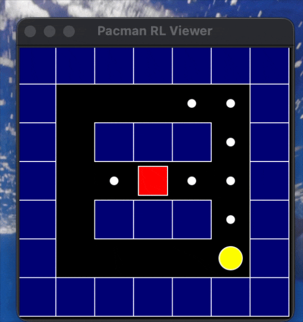

<h3 align="center">Pacman Reinforcement Learning Agent</h3>

  

This project implements a **reinforcement learning agent** that learns to play **Pacman**
by interacting with a **custom-designed environment** and optimizing cumulative rewards.
A lightweight GUI is used to visualize the agent’s behavior during gameplay.

---

## 🧠 Overview

The objective of this project is to demonstrate an **end-to-end reinforcement learning workflow**:
from environment design, to agent learning, to visual evaluation of performance.

The agent observes the current game state, selects actions, receives rewards,
and improves its policy through repeated interaction with the environment.

---

## ⚙️ Approach

### Environment
- Custom Pacman environment defining states, actions, and rewards
- Handles movement, collisions, and terminal conditions

### Reinforcement Learning Agent
- Learns a policy based on reward feedback
- Balances exploration and exploitation over episodes

### Visualization
- GUI-based interface to observe agent decisions in real time

Pull Shark commit 1
Pull Shark commit 2
